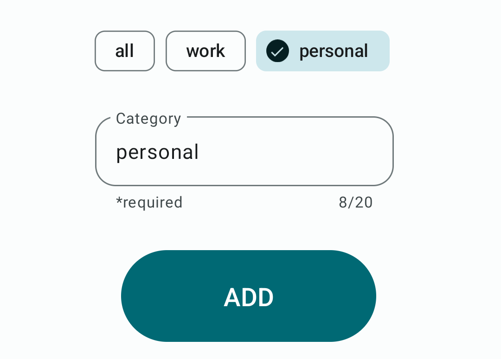

# YouToDo

A simple Android application that allows to easily create and manage to-dos, providing a
clean and pleasant UI thanks to [Material Design 3](https://m3.material.io/), with
customizable colors and themes.

## Home page

## Create and manage to-do page

## Create and manage categories

## Settings page

